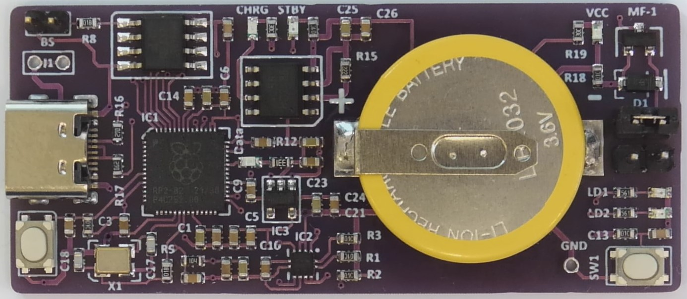
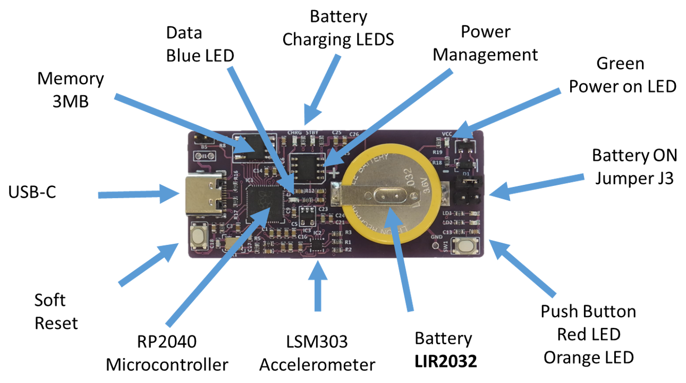

Accelerometer Test Module
-------------------------

Description
~~~~~~~~~~~

The Accelerometer Test Module is designed to measure acceleration in three dimensions.  It 
contains a Raspberry P1 microprocessor RP2040 coupled to an accelerometer LSM303C.  The module 
contains an 80 mAH battery, USB-C connectivity to a PC plus a push button and LEDs connected 
to the RP2040

Specification
~~~~~~~~~~~~~

        +--------------------------------------+----------------------------------------------+
        | Operating Temperature                | 0 to 50 deg C                                |
        +--------------------------------------+----------------------------------------------+
        | Interface                            | USB - C                                      |
        +--------------------------------------+----------------------------------------------+
        | Voltage                              | 5 volts via USB-C regulated to 3.3 volts     |
        +--------------------------------------+----------------------------------------------+
        | Current                              | Typical 20 mA                                |
        +--------------------------------------+----------------------------------------------+
        | Size                                 | 26 x 60 mm                                   |
        +--------------------------------------+----------------------------------------------+
        | Weight                               | 8.5g - approx.                               |
        +--------------------------------------+----------------------------------------------+
        | Microcontroller                      | RP2040                                       |
        +--------------------------------------+----------------------------------------------+
        | Memory                               | 3 MB  - Typical AT25SF321                    |
        +--------------------------------------+----------------------------------------------+
        | Accelerometer                        | LSM303  3 axis accelerometer / magnetometer  |
        +--------------------------------------+----------------------------------------------+
        | Power Management                     | TP4056  -  AD3401                            |
        +--------------------------------------+----------------------------------------------+
        | Battery                              | LIR2032 Li-Ion 3.6/3.8 volts nominal 80mAH   |
        +--------------------------------------+----------------------------------------------+
        | Data Transfer LED                    | Blue LED indicate data transfer via USB-C    |
        +--------------------------------------+----------------------------------------------+
        | Soft Reset                           | Soft Reset via Push Button                   |
        +--------------------------------------+----------------------------------------------+
        | Push Button                          | Application Push Button                      |
        +--------------------------------------+----------------------------------------------+
        | LEDs                                 | Red and Orange LEDS for applications         |
        +--------------------------------------+----------------------------------------------+

Application
~~~~~~~~~~~

The module can be used to measure acceleration in three dimensions

Module Description
~~~~~~~~~~~~~~~~~~

The module has been designed as a subset of the Kookaberry and as such can run the Kookaberry 
firmware and make use of the IDE features in the KookaSuite -  being the KookaIDE, KookaBlockly 
and the KookaTW.  The latest versions of KookaSuite can be downloaded from Github at 
kookaberry/kooka-releases.

