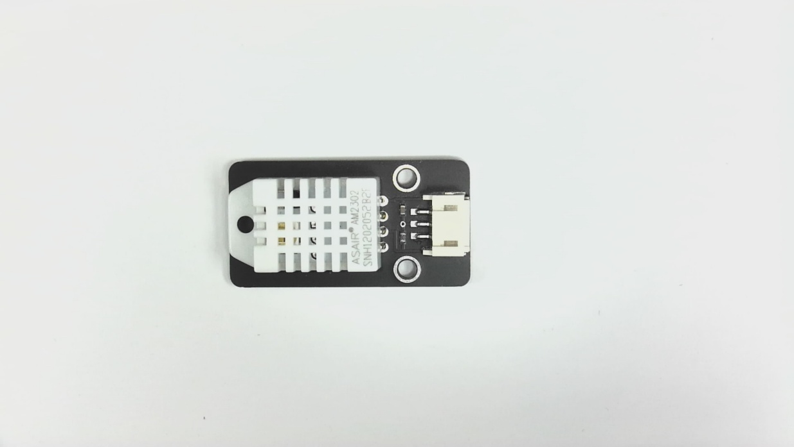

Humidity Temperature –DHT22 Module
==================================                 
QK-02-033

  
Description

The DHT22 module is a low cost digital temperature and humidity sensor which uses a DHT22 or AM2302 sensor.  When connected to the Kookaberry it uses a 3 pin JST PH connector cable QK-03-022. Communication with the module is via serial digital signal on a single bus.  A driver for this module is embedded in the MicroPython firmware of the Kookaberry.
The module must be kept dry and cannot be immersed in water.  When retrieving information from the module data can only be obtained every 2 seconds
The DHT22 sensor is more precise than the DHT11 and works over a larger range of temperature and humidity.  It is factory calibrated to meet its specifications.

Specification

	Operating Temperature 	                -10 to 50 deg C
Interface	Quokka 3 Pin JST PH 
Pin 1= Signal, Pin2= VCC, Pin 3 = GND
	Voltage				3.3 volts max 
	Size				20 x 40 mm
	Humidity			between 0 to 99% with a  2 to 5% accuracy
	Temperature			between -40 to 80 deg C with a +/- 0.5% accuracy
	Sampling			No more than 0.5 Hz sampling once every 2 seconds.
		

Pin Out

Connector - JST PH 3 Pin

                Pin 1 – Signal        			On = Hi=3.3 volts (max) 
		Off = Low = 0 volts
	Pin 2 – VCC            		3.3 volts (max) 
	Pin 3 - GND            		0 volts

Application
The module is used to monitor temperature and humidity in outdoor or indoor settings such as weather stations, home appliances, data logger etc. The module cannot be immersed in water.

Sample Code

Connect a DHT22 to connector P1 on the Kookaberry
            
KookaBlocs

KookaCode

Reference Schematic

 
